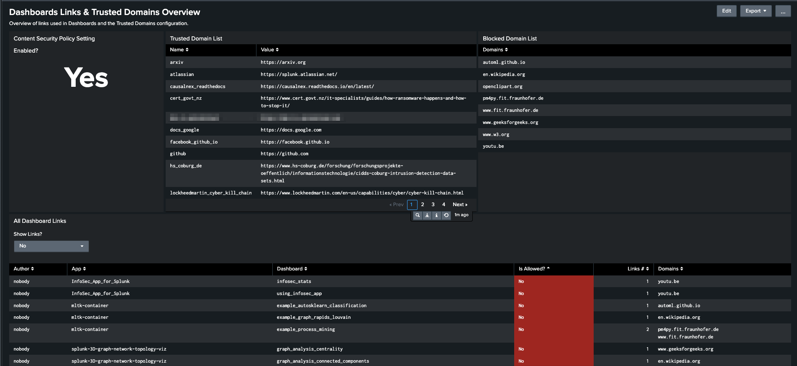
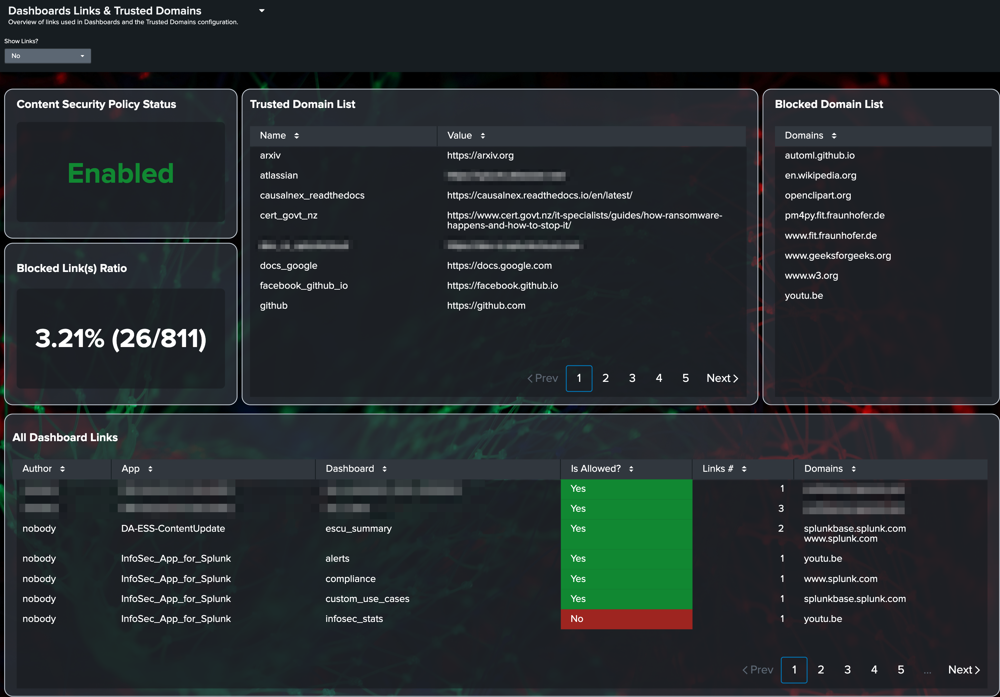

# Dashboard Links and Trusted Domains Overview

## Overview

This application for Splunk Cloud gives you insight into use of external links in your Dashboards and if they are allowed or not in the Trusted Domains Splunk configuration.  See the official Splunk documentation for this feature [here](https://docs.splunk.com/Documentation/SplunkCloud/latest/Admin/ConfigureDashboardsTrustedDomains) and this blog post [here](https://www.splunk.com/en_us/blog/platform/improving-security-updates-to-classic-simplexml-dashboards-containing-external-links-or-content.html) for details.

It aims to quickly show you the links used in any of your dashboards and if the links/domains used are currently allowed or not in your environment.

### About the **Dashboard Links and Trusted Domains Overview** app

|                       |                                                         |
|-----------------------|---------------------------------------------------------|
| Version               | 1.0.0                                                   |
| Visible in Splunk Web | Yes.                                                    |

## Compatibility

The current version of this app is compatible with:

- Splunk Cloud, any version

## Description

The **Dashboard Links and Trusted Domains Overview** app displays an overview of the current state of the Content Security Policy feature (enabled or not), a list of currently Allowed/Trusted Domains/URLs as well as currently blocked Domains/URLs.  This is done by extracting external links from all Dashboards in the Splunk environment and comparing them to the current **Trusted Domains List** configuration.

This covers the following HTML tags:

- `a`
- `applet`
- `audio`
- `base`
- `embed`
- `form`
- `frame`
- `iframe`
- `img`
- `link`
- `object`
- `script`
- `style`
- `track`
- `video`

**Note:** Splunk domains (*.splunk.com) are considered **Trusted** by default.

## What it looks like

There is also a Dashboard Studio version:

## Notes & Feedback

If you have feedback on this Splunk app. (improvement ideas, issues, questions), feel free to contact me via email or open an issue on this project on GitHub.

This add-on was run through [AppInspect](https://dev.splunk.com/enterprise/docs/developapps/testvalidate/appinspect/) and any issues corrected to the best of my knowledge.